# Project3

## Introduction and Goal: 

If you aspire to be environmental-friendly, avoid your city's traffic and your city has a public bicycle sharing system like the Velib in France, the Santander Cycles in London or the Capital Bikeshare in Washington D.C. then you as a responsible Earth-dweller may have been confronted to two problems: not finding a bike in your nearest bike station and not finding a free spot at your destination's station. To answer this issue, the bike's company needs to know the variability of the demand throughout time. 

This project analyzes the statistical measures of the demand in rental bikes in function of the time, day in the year as well as the weather. 

## Questions for Exploration

1. What's the distribution of the demand for rental bikes throughout time? Is the demand higher in the weekdays than the weekends? In any normal day, is there a pattern in the bike-usage over the course of time? 

2. Is there a difference in usage between a casual and a registered user? (Are they statistically different?)

3. How influential is the weather with both users? Will a nice day be more enticing to use the bike over a rainy day? Does the wind or temperature discourage people to take the bike? 

4. Can the temperature felt be characterized by a combination of windspeed, humidity and official temperature? 

5. Can we predict the count of bikers given the time, day and weather? 

# Acquire the data

The dataset is taken from Kaggle's Bike Sharing Dataset, containing data of rental bikes from Capital Bikeshare for the period between the years of 2011 and 2012. This data is segmented by: 
- Date (segmented in year, month and day) and time represented by the hour of use. 
- The number of bikes in use by the hour.  
- The user type: Registered and Casual (independent events). 
- Whether the day is a holiday or not, a working day or a weekend. 

Moreover the weather information from freemeteo.com is merged with the dataframe adding 5 columns: 
- A brief categorical description of the sky (clear, scattered clouds, light rain, heavy snow or rain)
- Temperature in celsius normalized by a factor of 41, 
- Feeling temperature (*atemp*) in Celsius normalized by a factor of 50, 
- Normalized Humidity by a factor of 100 and 
- Normalized Windspeed by a factor of 67

# PreProcessing

The following operations will prepare and refine the data for the analysis:

1. Parse e.g. convert strings to timestamps and extract date & time components to columns
2. Cast to  the adequate data types
3. Handle missing or incomplete data
>There are some missing values, ideally a filling function would consider the missing hourly-values as well as the trend of the non missing values throughout the remaining hours of the day. So an interpolation from the previous hour and the next seems appropriate. 

4. Normalize the number of bikes per day 
> The demand distribution is right skewed with several outliers. To correct this, these values will be normalized in function of the total demand per day. 

5. Create downsampled Dataframes 
>Group the hourly data into daily data and daily data into weekly data. The daily sampling behaves more like a normal distribution than the hourly distribution. Without outliers on the total and registered type count, these two distributions seem pretty normal. 

## What is the distribution of the demand for rental bikes throughout the day? Is there a significant difference between the weekdays and the weekends? 

The purpose of this analysis is to see how the demand for bikes fluctuates throughout the week and the weekends and thus develop a suitable model for the supply chain to keep the demand balanced.

A **t-Test** shows a p-value lower than the significance level (0.05) so **the null hypothesis is rejected**, which means if we were to construct a 95% confidence interval for the sample it would not capture the weekday distribution mean. ***Therefore the demand in the weekends is different (statistically significant) than in the weekdays and we can notice this in the figure below where the demand distribution is graphed by the hour.***

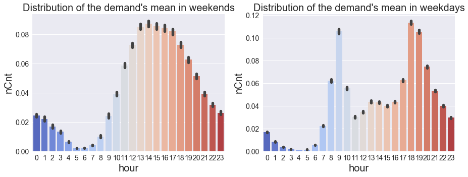

In the weekends bikers start their day around 9am and then it goes incrementally til 1pm to then begin a smooth decline in the late night hours and reach an inactivity state around 5am-6am. 
Activity on the weekdays appears to have 2 peaks, one at 9am and the other one at 6pm. The comparison made by the t-test is noticeable so we can appreciate how the demand is different amongst these 2 groups of the week. 

## Is there a difference in usage between a casual and a registered user?

The figure below shows a comparisson of the distributions of the number of bikes in use by registered vs casual users in function of:
1. the time of day 
2. and whether it's a holiday/weekend or just a normal weekday. 

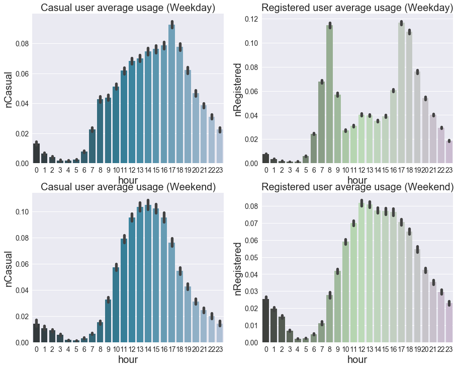

Figures 1, 3 and 4 are show a similar distribution. Figure 1 represents the average usage for the casual user on a weekday peaking at 5pm, whereas figure 3 shows the casual user on a weekend having a high demand in the afternoon and figure 4 are the registered users on a weekend also demanding high volumes of bikes starting at noon and carrying on in throughout the rest of the evening. 

It's important to consider that in the distribution of the demand's mean in weekdays graph, the influence of the casual users was not big enough to modify the shape of the distribution because the user type ratio is slightly higher than 6:1. 

We can notice that registered users are more intense over the weekends starting to bike earlier than their fellow casual users. So it is interesting to see if these 2 proportions are different from one each other in terms of bike usage. For that another 2 sample t-test will answer our question.  

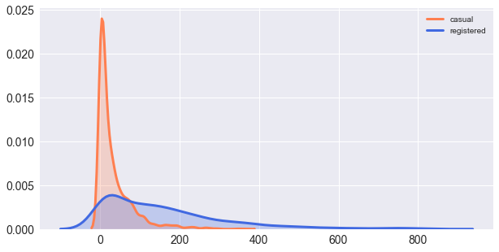

The p-value is so small that the null hypothesis can be rejected and thus ***both groups are not identical but statistically different***

## Can the temperature felt be characterized by a combination of windspeed, humidity and official temperature? 

The scatter plot of the hourly records looks a bit noisy and with some outliers around the "feels like" temperature of 0.25. A re-sampling showed an improvement of the visibility of the possible relationship. 

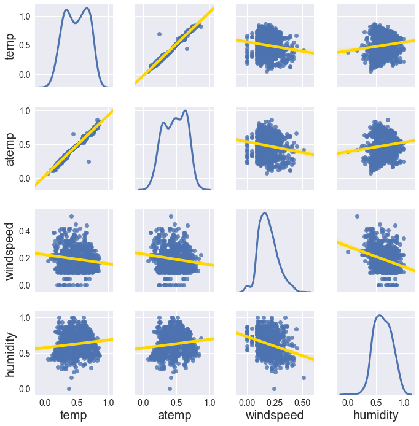

Unfortunately the windspeed and the humidity show no relationship with other factors that can be deduced at the simple eye.
However the temperature is highly correlated (0.99) with the temperature felt. 

To find the optimal number and best combination of predictors, the **cross validation** method threw the model with the least RSS and 3 predictors where the summary is shown below:

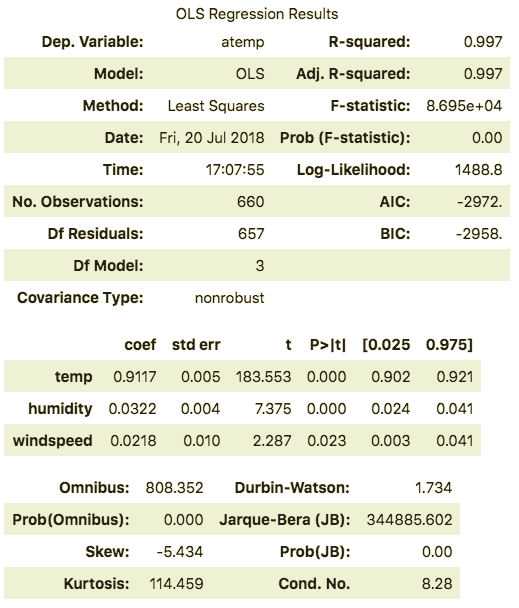

The p value for windspeed is not small enough so we can consider temp and humidity as the best predictors for the temperature felt. The figure below shows the residual plot with a mean of zero and fairly homoscedastic 

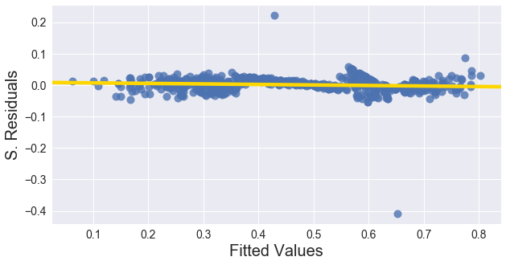

Residuals do not contradict the linear assumption. 
The quantile-quantile plot of the residuals shows that they are normally distributed, making of the model a good fit. The zone of interest in the q-q plot is the middle so the extreme points in the sides can be ignored. 

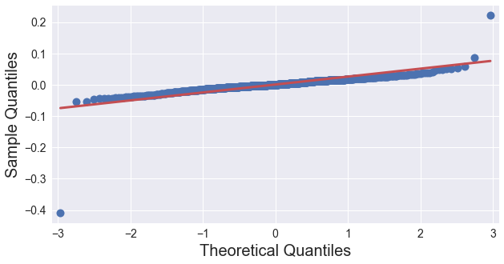

## 4. How influential is the weather with both users? 

Will a nice day be more enticing to use the bike over a rainy day? Does the wind and/or temperature discourage people to take the bike?
In the figure below the total demand is displayed throughout the 2 years with a sampling period of a week. The demand seems to fluctuate in cycles, seasons and even has a positive trend. 

From the figure below we can see that the temperature measured and the temperature felt have a strong correlation with the demand for bikes. 

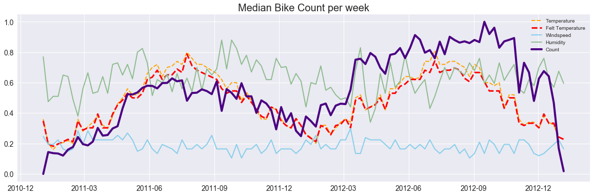

The count seems to correlate with the temperature and the feels-like temperature. During the 2 years the cycles of the temperature seem to follow with those of the demand. 

Furthermore it can be seen that almost every change in humidity there is an opposite change in demand...

Similarly to the previous question an exhaustive search for the optimal combination of predictors took place and the cross validation method showed the best results (lowest RSS) with a single predictor model using temperature-felt. The temperature felt can therefore be considered as our main weather descriptor as seen earlier it's a variable that is determined by a somewhat linear relationship with temperature measured windspeed and humidity. 

The figure below shows the method implemented to determine the optimal number of predictors with the lowest value of RSS, AIC and BIC, and highest value of the adjusted r squared. 

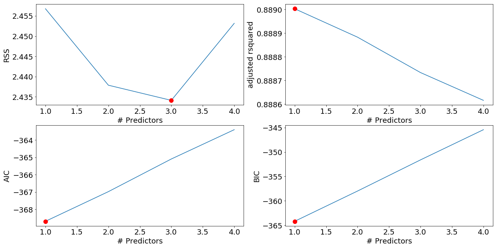

The residual plot and quantile plot below shows a somewhat normally distributed residuals with equal variance 

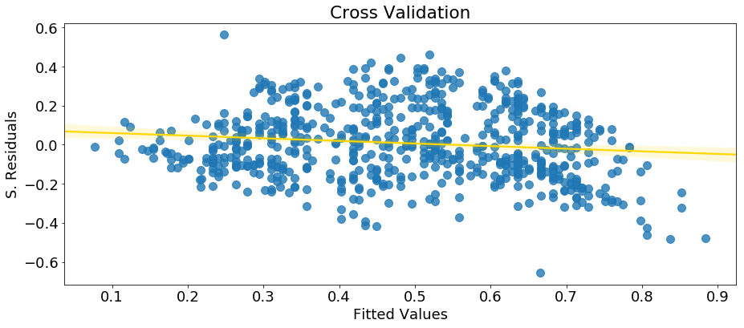

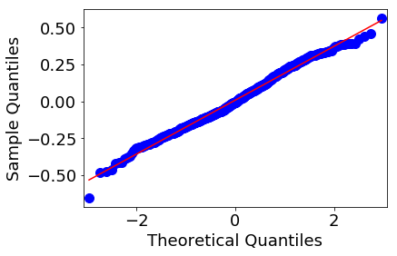

**Furthermore** the correlation can be improved by adding polinomial degrees to the temperature felt slope. Below is shown how after the 3rd polinomial degree the squared correlation coefficient is reaching a value of 0.45

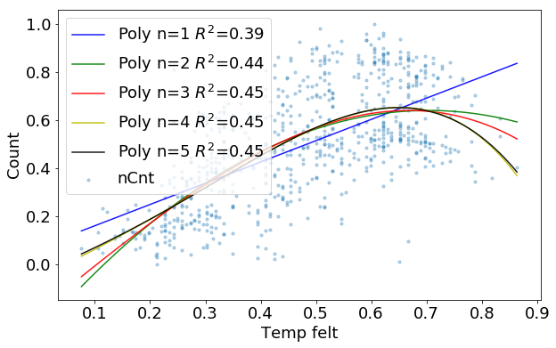

## 5. In any normal day, is there a pattern of the usage over the course of time? Can we predict the count of bikers given the time, day and weather?

I will use the weekly-average to reduce the seasonality and trend of the total demand. Then it will go through a smoothing process of 2 days average and the result is shown below:

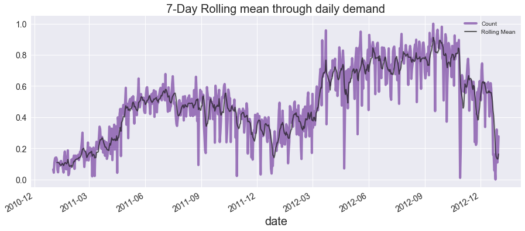

Using the weekly sampled data, I tested forecasting the demand with the aid of the conventional models and the most promising ones were: 
1. The manual modeled by a customized sinusoidal signal. 
2. A regression model with temperature felt as its predictor. 
3. A 101 Arima model. 

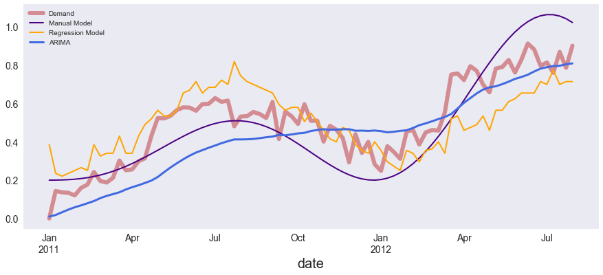

The ARIMA model has the same RMSE as a linear model characterized by the trend of the signal. The differenced signal resulted in a stationary signal created by subtracting the demand with a Simple Exponential Smoothing model as it showed a high fidelity following the demand. However the best model with the lowest RMSE is the manual sine model.

And their RMSE: 
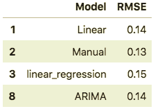

Looks like the sine model yields the best results. Lets see if applies to the test dataset. I will now forecast the 5 remaining months in the test set using the 3 best models. 

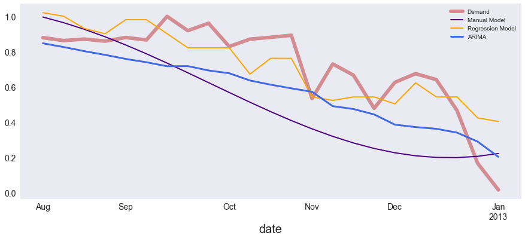

The best model for the training set is not the best for the test set. In this testing phase looks like the linear regression model has the best prediction. Recalling the predictor used for this model was the temperature felt. 
The Arima model didn't fall behind, predicting better than the manual model sine. 

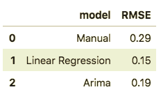

## Conclusion and further work

The manual model showed pretty good results on the training set however the results were different on the test set where the regression model got the lowest RMSE value of 0.15. 
The parameters of the manual model are not optimal, which means an exhaustive search for the lowest RMSE can be done in future works to beat the linear regression's model RMSE. 
This study shows how the temperature is a decisive descriptor of the number of bikes rented and knowing the weather patterns throughout time can save bike rental companies from problems related to the number of bikes available.

There is also a pattern on the daily demand, adding dayofweek as a categorical variable could improve the model accuracy because the loss rate will have been minimized compared to a linear average on all entities.

