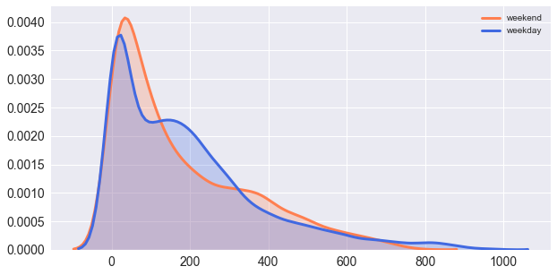

# Project3

## Introduction and Goal: 

If you aspire to be environmental-friendly, avoid your city's traffic and your city has a public bicycle sharing system like the Velib in France, the Santander Cycles in London or the Capital Bikeshare in Washington D.C. then you as a responsible Earth-dweller may have been confronted to two problems: not finding a bike in your nearest bike station and not finding a free spot at your destination's station. To answer this issue, the bike's company needs to know the variability of the demand throughout time. 

This project analyzes the statistical measures of the demand in rental bikes in function of the time, day in the year as well as the weather. 

## Questions for Exploration

1. What's the distribution of the demand for rental bikes throughout time? Is the demand higher in the weekdays than the weekends? In any normal day, is there a pattern in the bike-usage over the course of time? 

2. Is there a difference in usage between a casual and a registered user? (Are they statistically different?)

3. How influential is the weather with both users? Will a nice day be more enticing to use the bike over a rainy day? Does the wind or temperature discourage people to take the bike? 

4. Can the temperature felt be characterized by a combination of windspeed, humidity and official temperature? 

5. Can we predict the count of bikers given the time, day and weather? 

# Acquire the data

The dataset is taken from Kaggle's Bike Sharing Dataset, containing data of rental bikes from Capital Bikeshare for the period between the years of 2011 and 2012. This data is segmented by: 
- Date (segmented in year, month and day) and time represented by the hour of use. 
- The number of bikes in use by the hour.  
- The user type: Registered and Casual (independent events). 
- Whether the day is a holiday or not, a working day or a weekend. 

Moreover the weather information from freemeteo.com is merged with the dataframe adding 5 columns: 
- A brief categorical description of the sky (clear, scattered clouds, light rain, heavy snow or rain)
- Temperature in celsius normalized by a factor of 41, 
- Feeling temperature (*atemp*) in Celsius normalized by a factor of 50, 
- Normalized Humidity by a factor of 100 and 
- Normalized Windspeed by a factor of 67

# PreProcessing

The following operations will prepare and refine the data for the analysis:

1. Parse e.g. convert strings to timestamps and extract date & time components to columns
2. Cast to  the adequate data types
3. Handle missing or incomplete data
>There are some missing values, ideally a filling function would consider the missing hourly-values as well as the trend of the non missing values throughout the remaining hours of the day. So an interpolation from the previous hour and the next seems appropriate. 

4. Normalize the number of bikes per day 
> The demand distribution is right skewed with several outliers. To correct this, these values will be normalized in function of the total demand per day. 

5. Create downsampled Dataframes 
>Group the hourly data into daily data and daily data into weekly data. The daily sampling behaves more like a normal distribution than the hourly distribution. Without outliers on the total and registered type count, these two distributions seem pretty normal. 

## What is the distribution of the demand for rental bikes throughout the day? Is there a significant difference between the weekdays and the weekends? 

The purpose of this analysis is to see how the demand for bikes fluctuates throughout the week and the weekends and thus develop a suitable model for the supply chain to keep the demand balanced.

